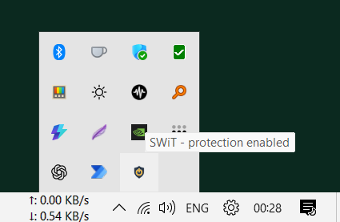
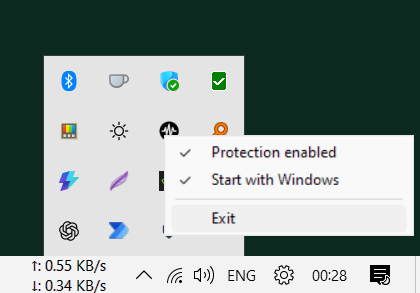
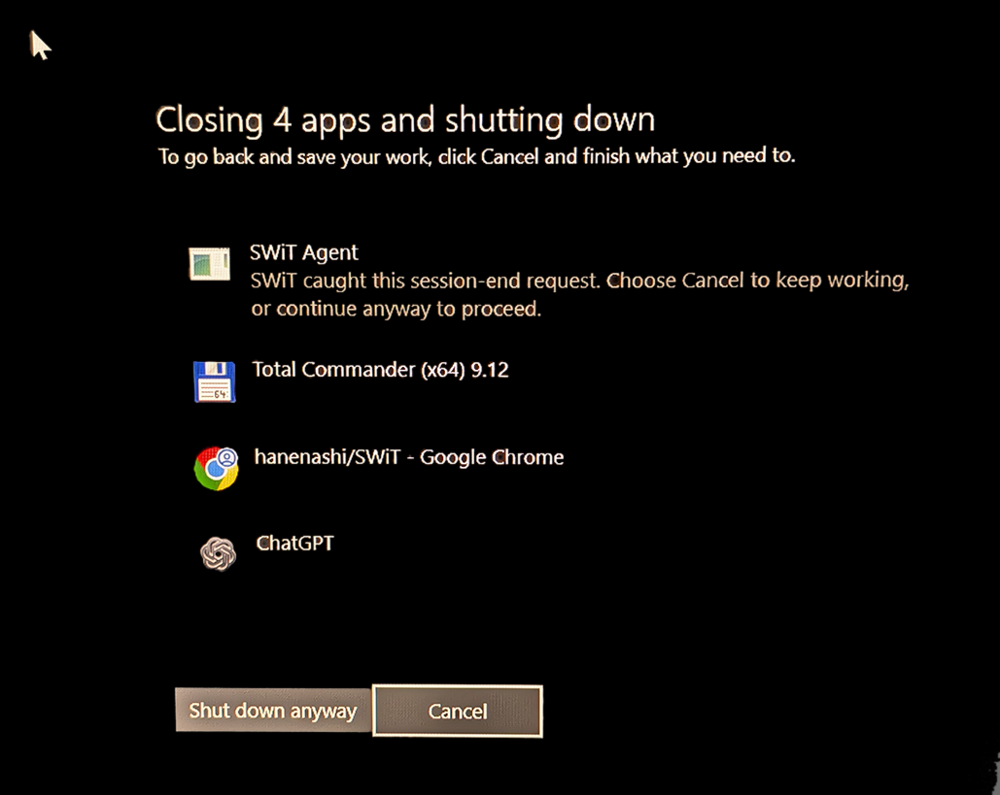

# SWiT

SWiT is a small Windows 11 utility whose goal is to prevent accidental shutdowns.

## TL;DR

1. Download and run the current installer from [Releases](https://github.com/hanenashi/SWiT/releases).
2. SWiT starts with Windows and lives in the notification area. Keep **Protection enabled** checked; right-click the icon to change protection, startup, or exit.

<p>
  
  
</p>

3. Shut down normally. When Windows shows the screen below, choose **Cancel** to keep working or **Shut down anyway** to proceed.



## How It Works

The intended behavior is:

1. The user clicks **Start -> Power -> Shut down**.
2. Windows begins ending the interactive session.
3. SWiT receives the shutdown query before ordinary applications.
4. SWiT immediately blocks the request with a clear reason.
5. Windows shows its native **Shut down anyway / Cancel** screen.
6. Cancel preserves the session; Shut down anyway continues forcefully.

## Current Status

The clean implementation now has a per-user agent, an application-first
shutdown level, a native Windows confirmation flow, logging, and synthetic test
tools. It also enforces a single instance and provides a notification-area icon
for enabling/disabling protection or exiting. A per-user Windows installer now
provides a stable install location, sign-in startup, Start menu shortcuts, and
complete uninstall. The older hidden-window, service, and hook experiments remain archived under
`archive/2026-07-21-pre-restart/` as research material.

## Design Direction

Preferred architecture:

- `swit-agent.exe`: per-user background process started at sign-in.
- Hidden top-level window for shutdown notifications.
- `WM_QUERYENDSESSION` handler decides whether to block the shutdown.
- `ShutdownBlockReasonCreate` provides the visible reason Windows shows when
  shutdown is blocked.
- Windows' full-screen blocker UI is the confirmation surface.
- Notification-area icon with protection toggle and clean Exit command.
- Per-user install under `%LOCALAPPDATA%\Programs\SWiT` without elevation.
- Runtime logs under `%LOCALAPPDATA%\SWiT\logs`.

Avoid as the primary design:

- Global Windows hooks.
- Injecting into Explorer, Start menu, or shell processes.
- A service-first design that needs to cross session boundaries just to show UI.

## Important Windows Behavior

Windows sends `WM_QUERYENDSESSION` when the user or an application requests logoff
or shutdown. If any GUI application returns zero, the session is not ended.

Shutdown blocking is limited by Windows. If an app takes too long or the user
forces shutdown, Windows can continue. SWiT should be treated as an accidental
click guard, not as a hard power-control policy.

Useful Microsoft references:

- `WM_QUERYENDSESSION`: https://learn.microsoft.com/en-us/windows/win32/shutdown/wm-queryendsession
- `WM_ENDSESSION`: https://learn.microsoft.com/en-us/windows/win32/shutdown/wm-endsession
- Shutdown changes and blocking behavior: https://learn.microsoft.com/en-us/windows/win32/shutdown/shutdown-changes-for-windows-vista
- Application shutdown guidance: https://learn.microsoft.com/en-us/windows/win32/shutdown/shutting-down
- Service shutdown and preshutdown controls: https://learn.microsoft.com/en-us/windows/win32/services/service-control-handler-function

## Build

The restarted version currently builds directly with MSVC `cl.exe`. Move to
CMake only if the project needs more structure.

Expected developer shell:

```cmd
x64 Native Tools Command Prompt for VS
```

From a normal shell, the build script discovers and loads the VS 2022 x64
toolchain:

```cmd
scripts\build.bat
scripts\build.bat release
```

Outputs:

```text
build\swit-agent.exe
build\swit-send.exe
build\swit-helper.exe
```

The default configuration is a debug build. Release builds are optimized,
use the static C++ runtime, and embed SWiT's icon and version metadata.

## Installer

Install the pinned, verified Inno Setup compiler once, then build a release:

```powershell
.\scripts\install-inno.ps1
.\scripts\build-release.ps1
```

Outputs:

```text
dist\SWiT-Setup-0.1.0-alpha.1-x64.exe
dist\SHA256SUMS.txt
```

The installer targets Windows 11 x64-compatible systems, installs only for the
current user, requires no administrator rights, and offers sign-in startup
selected by default on first install. Upgrades preserve the user's existing
startup choice. Uninstall stops the agent and removes SWiT's files, startup
entry, shortcuts, and logs.

The current alpha installer is not Authenticode-signed, so Windows SmartScreen
may warn. `scripts\build-release.ps1` supports signing when a code-signing
certificate thumbprint is supplied. See `docs\packaging.md`.

Run the no-shutdown smoke harness from the repository root:

```cmd
build\swit-agent.exe --test-mode --cancel-on-query --log logs\smoke.log
build\swit-send.exe ping
build\swit-send.exe shutdown
build\swit-send.exe restart
build\swit-send.exe logoff
build\swit-send.exe disable
build\swit-send.exe shutdown
build\swit-send.exe enable
build\swit-send.exe shutdown
build\swit-send.exe exit
```

Normal startup blocks shutdown and relies on Windows' native confirmation UI.
`--cancel-on-query` explicitly selects the same behavior, while
`--allow-on-query` is a diagnostic mode. `swit-send.exe` remains available as a
CLI alternative to the tray controls.

Run SWiT as the signed-in user, not from an elevated terminal. Elevation is not
required and prevents a normal `swit-send.exe` process from controlling it.

The notification icon may initially appear in Windows' tray overflow. Its menu
contains **Protection enabled**, **Start with Windows**, and **Exit**. The same
controls are available from a terminal:

```cmd
build\swit-send.exe disable
build\swit-send.exe enable
build\swit-send.exe startup-enable
build\swit-send.exe startup-disable
build\swit-send.exe exit
```

The startup preference is persisted in the current user's Windows `Run` key.
The protection toggle is intentionally not persisted: every fresh SWiT process
starts protected.

Without `--log`, logs are written to:

```text
%LOCALAPPDATA%\SWiT\logs\swit-agent.log
```

Starting `swit-agent.exe` again in the same user session exits immediately and
leaves the existing agent untouched.

If you start the executables from inside `build\`, use `swit-send.exe` directly
and pass an absolute or `..\logs\...` log path if you want logs under the repo
root.

Run the ordering helper:

```cmd
build\swit-helper.exe --log logs\helper-default.log
build\swit-send.exe --helper ping
build\swit-send.exe --helper exit

build\swit-helper.exe --level 0x180 --log logs\helper-late.log
build\swit-send.exe --helper exit
```

## Legacy Notes

The old code and backups are archived under
`archive/2026-07-21-pre-restart/`. Do not delete or overwrite them until the
useful details from the old AI chat and manual experiments have been reviewed.

See `docs/history.md` for recovered notes from the old Grok conversation and
local Codex session search.

## Planning Docs

- `docs/roadmap.md`: phased rebuild plan.
- `docs/testing.md`: shutdown-safe test battleplan.
- `docs/design.md`: technical design notes.
- `docs/knowledgebase.md`: Windows shutdown model notes relevant to SWiT.
- `docs/history.md`: recovered history from old AI chats and experiments.
- `docs/packaging.md`: installer, release, signing, and distribution notes.
